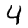

# goANN

go implementation of a topologically-structured, deep-learning, back-propagation, sigmoidal Artificial Neural Network, built to analyze hydrological time-series.

> *"bad at logic, good at Frisbee"*
>
> -- <cite>Andy Clark</cite>

------------
## benchmarking
The intention was to make a go code that is optimized for performance. The learning ability of an ANN can be described in vector notation, and computed using matrix algebra. For instance, the description provided by [sausheong.github.io](https://sausheong.github.io/posts/how-to-build-a-simple-artificial-neural-network-with-go/) (accessed November, 2021) describes this well. 

From a computational efficiency standpoint, codifying ANN using matrix algebra requires specialized data structures to represent and handle matrices. When working with procedures that require a large number of repeated computations (like machine learning), the cost of initializing these data structures will add up.

Rather than abstracting the ANN as a set of matrices need solving, the ANN is built as a conceptual neural network, where the topology (i.e., neurons and their connection to subsequent neurons) is made explicitly. The ANN then become a directional graph and the use of graph theory can help determine how the neural network behaves as a system.

As a test, the code provided on [sausheong.github.io](https://sausheong.github.io/posts/how-to-build-a-simple-artificial-neural-network-with-go/) is assumed a benchmark and the performance of goANN is compared against that. 

>**IT MUST BE STATED:** *that the author (me) acknowledges and assumes that no intention was made by the benchmark code developers to optimize their routines. There will likely be areas were the benchmark code I'm testing against could have be made more efficient and so it is __NOT__ the objective here to make improvements to their code such that I can ensure the comparison made here is at all "Fair."*

I'm just testing my code.

### Test 1: hand written character recognition
------------------------

>Let's start with a "hello world" of machine learning
>
>-- <cite>Chang Sau Sheong</cite>

Using the test original to [sausheong.github.io](https://sausheong.github.io/posts/how-to-build-a-simple-artificial-neural-network-with-go/), hand writing recognition is tested against the [MNIST dataset](http://yann.lecun.com/exdb/mnist/). In the directory ./benchmark1/matrix, the original code from [sausheong.github.io](https://sausheong.github.io/posts/how-to-build-a-simple-artificial-neural-network-with-go/) is provided.

A couple of notes on the benchmark code: because the intention was to introduce the reader to ANNs, [sausheong.github.io](https://sausheong.github.io/posts/how-to-build-a-simple-artificial-neural-network-with-go/) provided the __*"vanilla"*__ (read: simplest) form an ANN. Specifically, the code represents a single, 200 neuron, hidden-layer where only weights are adjusted from input to hidden to output.

The graphical version *./benchmark1/graph* used the same ANN structure, only that neuron activation biases have been included as they are standard practice in hydrology (Zhu etal., 1994). This will impact the skill of the ANN.

Training was based on 60,000 hand-written digits over 5 "epochs". Testing was made against another 10,000 images. Training and testing were performed 5 times each, average run times taken and overall skill are presented:

| method | training time | skill (n=10,000) |
|--|--|--|
| matrix | 7m59s | 61.53%
| graph | 7m03s | 55.13-70.27%

### Test 2: hydrograph (time-series) replication
------------------------
This purpose of the ANN developed here was to model continuos watershed runoff forced by a series of known precipitation events. A daily meteorological dataset is read by the neural nets and an attempt is to match observed stream flow. The dataset consists of 18,502 daily records and the neural nets are trained to this time-series over roughly 1350 epochs. (No attempt was made at the time of testing to break training on some convergence criteria.)

The ANN structure is much different from benchmark test #1: while still only consisting of 1 hidden layer, there are only 3 hidden neurons used.  The inputs are lagged by three days and a neural network is "partially recurrent", in that the prediction made in a previous 3 passes is added as input to the next prediction. 

$$
    Q(t)=Q(t-1) + Q(t-2) + ... + Q(t-n) + R(t) + R(t-1) + ... + R(t-n) + f(\text{day of year})
$$

As shown above, 3-day antecedent precipitation (i.e., $n=3$) is added to the input along a sinusoidal function ($f(\cdot)$) ranging from 0 to 1 at the winter and summer solstices, respectively. In all, there are $2n+1$ inputs and 1 output: Runoff.

Model performance is reported by the Nash-Sutcliffe efficiency factor:

$$
    R^2 = 1-\frac{\sum_t (Q_s^t-Q_o^t)^2}{\sum_t (Q_o^t-\bar{Q}_o)^2}
$$

Again, the average of 5 runs are reported:

| method | training time | $R^2$ |
|--|--|--|
| matrix | 3m00s | .533
| graph | 24s | .545

<!--  -->

### Test 3: hydrograph replication using LSTMs

More recently in the hydrologic modelling community, there has been an attraction to Long Short-Term Memory (LSTM) networks, as they *"ability to learn long-term dependencies between the provided input and output of the network, which are essential for modelling storage effects"* (Kratzert et.al., 2019).

In this benchmark, Test 2 is replicated only now, the performance of a partially-recurrent Neural Network is compared to an LSTM, in terms of their ability to simulate stream flow hydrographs. The LSTM code is based on a "simple" Python formulation offered [here](https://github.com/nicodjimenez/lstm) but translated to Go.  Note that for testing purposes, the LSTM code has been kept in its original matrix form as the computational efficiency is not the goal of this test, rather its skill in hydrologic prediction. The code's author, [nicodjimenez](https://github.com/nicodjimenez), also offers a nice description of LTSMs [here](https://nicodjimenez.github.io/2014/08/08/lstm.html).

## References

Kratzert, F., D. Klotz, C. Brenner, K. Schulz, and M. Herrnegger. 2018. Rainfall–runoff modelling using Long Short-Term Memory (LSTM) networks. Hydrol. Earth Syst. Sci., 22, 6005–6022.

Zhu M-L., M. Fujita and N. Hashimoto. 1994. Application of Neural Networks to Runoff Prediction *in Time Series Analysis in Hydrology and Environmental Engineering ed. K.W. Hippel, A.I. McLeod, U.S. Panu and V.P. Singh*. Water Science adn Technology Library. 474pp.